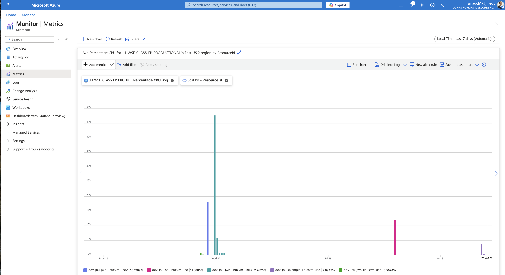

# Azure Cloud Cost Report – Week 1

## 1. Individual Cost for each Resource and Total Cost
- **dev-jhu-aiclass-iothub-demo2**: US$18.60  
- **dev-jhu-jwh-linuxvmdisk-use**: US$9.36  
- **dev-jhu-jwh-linuxvmdisk-use** (second disk): US$5.37  
- **Others**: US$29.29  
Total: US$62.62

[View in Azure Portal](https://portal.azure.com/#@live.johnshopkins.edu/resource/subscriptions/454f8f24-fd11-4fa7-8e95-8b0d80c25bb9/overview)

## 2. Total Projected Monthly Cost for your VM only
- Forecast for subscription: **US$63.16** (from Azure portal).  

## 3. Graph of CPU Utilization for your VM
[View in Azure Portal](https://portal.azure.com/#view/Microsoft_Azure_Monitoring/AzureMonitoringBrowseBlade/~/metrics)

## 4. Cost Profile Justification
- Costs mainly reflect **initial VM setup** (compute, networking, and storage).  
- Additional charges from public IP, NSG, disks, IoT demo resource  
- Expenses this week represent testing and environment configuration

## 5. % Change from Previous Week with Justification
- no previous week for comparison (its the first week)
