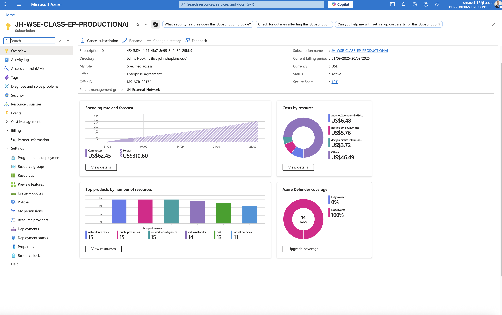
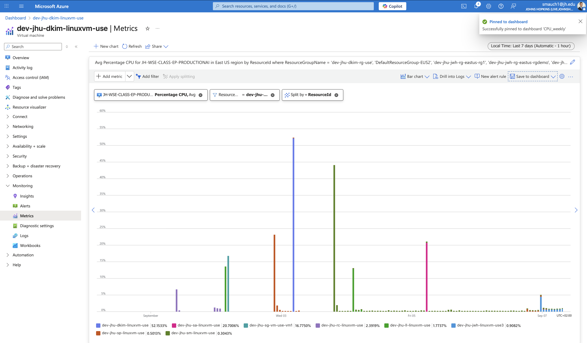

# Azure Cloud Cost Report – Week 2

## 1. Individual Cost for each Resource and Total Cost
- **aks-mod2demo-p…**: US$6.48  
- **dev-jhu-dkim-linuxvm-use**: US$5.76  
- **dev-jhu-aiclass-iothub-demo2**: US$3.72  
- **Others**: US$46.49  
Total: **US$62.45**

[View in Azure Portal](https://portal.azure.com/#@live.johnshopkins.edu/resource/subscriptions/454f8f24-fd11-4fa7-8e95-8b0d80c25bb9/overview)  

## 2. Total Projected Monthly Cost for your VM only
- Forecast for subscription: **US$310.60** (from Azure portal).  

## 3. Graph of CPU Utilization for your VM
[View in Azure Portal](https://portal.azure.com/#view/Microsoft_Azure_Monitoring/AzureMonitoringBrowseBlade/~/metrics)  

## 4. Cost Profile Justification
- Costs this week reflect **sustained VM activity**, AKS cluster usage, and supporting resources (network, storage, IPs).  
- IoT Hub demo resource charges decreased significantly compared to Week 1.  
- Increased forecast reflects **continuous VM consumption** expected for the rest of the billing cycle.  

## 5. % Change from Previous Week with Justification
- **Total cost**: US$62.45 vs US$62.62 → **-0.27% decrease**  
- **Justification**: Total spend remained stable, but the cost structure shifted — IoT Hub charges dropped, while AKS and VM usage rose.  
- **Forecast increased** due to ongoing workloads projected to run for the full billing month.  
