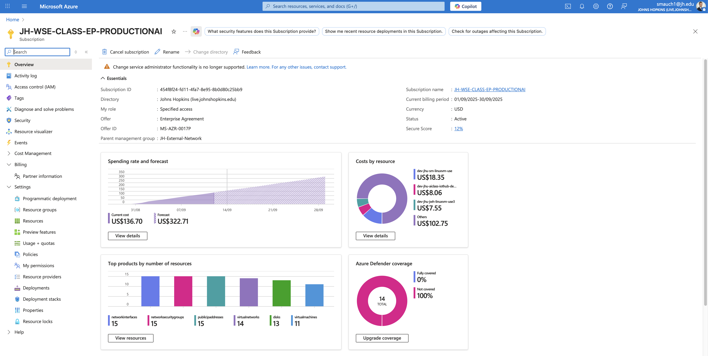
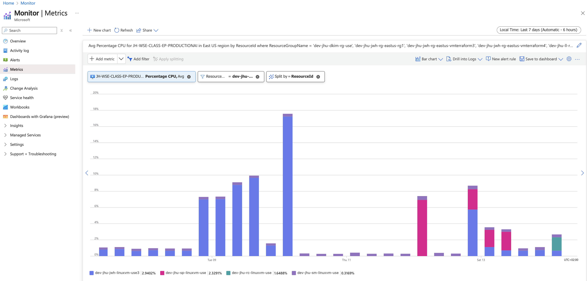

# Azure Cloud Cost Report – Week 2

## 1. Individual Cost for each Resource and Total Cost
- dev-jhu-sm-linuxvm-use: US$18.35
- ev-jhu-aiclass-iothub-demo2: US$8.06
- dev-jhu-jwh-linuxvm-use3: US$7.55
- Others: US$102.75
Total: US$136.70

[View in Azure Portal](https://portal.azure.com/#@live.johnshopkins.edu/resource/subscriptions/454f8f24-fd11-4fa7-8e95-8b0d80c25bb9/overview)  

## 2. Total Projected Monthly Cost for your VM only
- Forecast for subscription: **UUS$322.71** (from Azure portal).  

## 3. Graph of CPU Utilization for your VM
[View in Azure Portal](https://portal.azure.com/#view/Microsoft_Azure_Monitoring/AzureMonitoringBrowseBlade/~/metrics)  

## 4. Cost Profile Justification
- Costs this week reflect much higher VM activity, especially on dev-jhu-sm-linuxvm-use.
- IoT Hub demo charges slightly increased vs Week 2.
- Rising forecast aligns with sustained and continuous VM workloads expected for the remainder of the billing cycle.
The “Others” category also grew, indicating more supporting resource usage (network interfaces, disks, public IPs).

## 5. % Change from Previous Week with Justification
- Total cost: US$136.70 vs US$62.45 → +118.8% increase
- Justification: Costs nearly doubled due to expanded VM usage (new workloads or longer uptime) and additional supporting infrastructure, while the forecast increased accordingly to reflect this trend (because of component to component infrastructure assignment)
