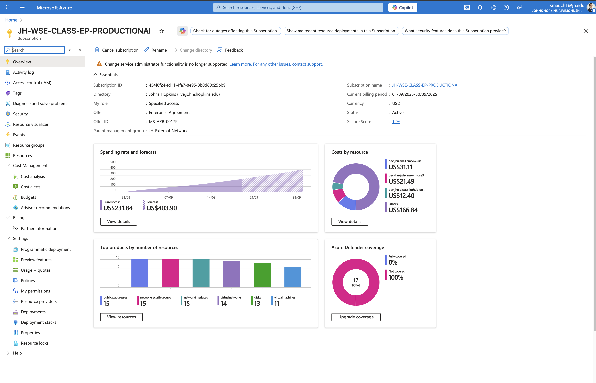
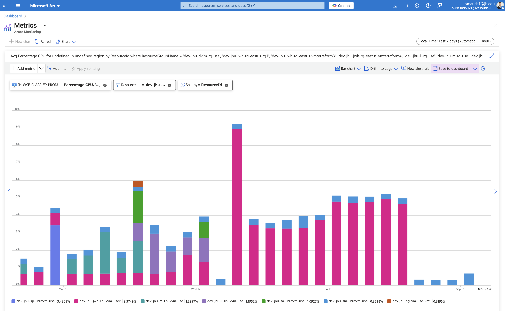

# Azure Cloud Cost Report – Week 2

## 1. Individual Cost for each Resource and Total Cost
dev-jhu-sm-linuxvm-use: US$31.11
dev-jhu-li-linuxvm-use3: US$21.49
dev-jhu-aiclass-iothub-demo2: US$12.40
Others: US$166.84
Total: US$231.84

[View in Azure Portal](https://portal.azure.com/#@live.johnshopkins.edu/resource/subscriptions/454f8f24-fd11-4fa7-8e95-8b0d80c25bb9/overview)  

## 2. Total Projected Monthly Cost for your VM only
Forecast for subscription: US$403.90 (from Azure portal).

## 3. Graph of CPU Utilization for your VM
[View in Azure Portal](https://portal.azure.com/#view/Microsoft_Azure_Monitoring/AzureMonitoringBrowseBlade/~/metrics)  

## 4. Cost Profile Justification
- VM costs increased sharply — dev-jhu-sm-linuxvm-use more than doubled vs Week 3.
- IoT Hub demo costs also rose slightly, consistent with continued usage.
- “Others” (network interfaces, disks, public IPs) grew substantially, reflecting higher supporting infrastructure demand.
- This matches observed CPU utilization trends: higher and more consistent workloads across multiple VMs.

## 5. % Change from Previous Week with Justification
- Total cost: US$231.84 vs US$136.70 → +69.6% increase
- Justification: Costs rose significantly due to sustained higher VM activity, especially on dev-jhu-sm-linuxvm-use, and additional infrastructure scaling. The forecast also adjusted upward, showing Azure expects elevated consumption for the remainder of the billing cycle.
