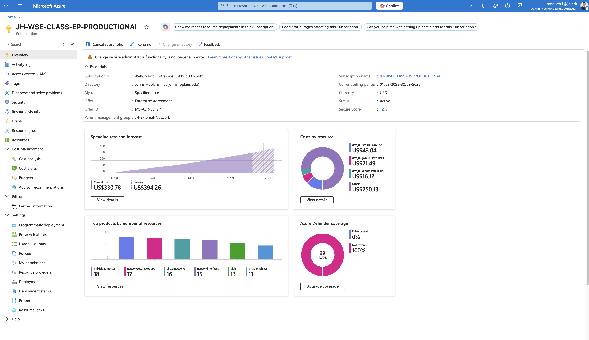
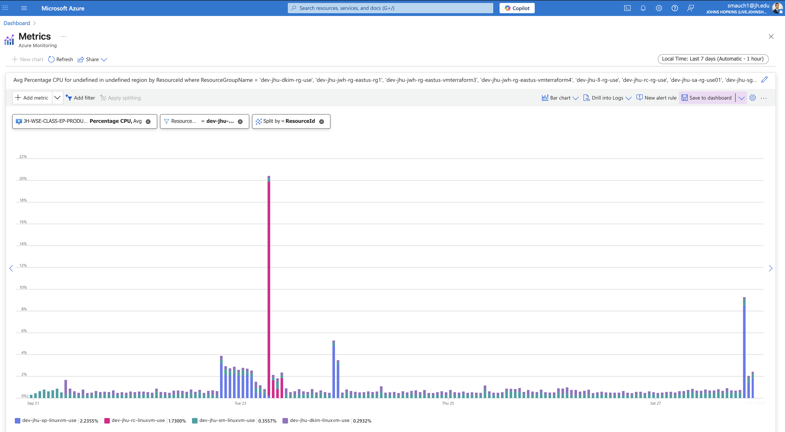

# Azure Cloud Cost Report – Week 5

## 1. Individual Cost for each Resource and Total Cost
dev-jhu-sm-linuxvm-use: US$43.04
dev-jhu-li-linuxvm-use3: US$21.49
dev-jhu-aiclass-iothub-demo2: US$16.12
Others: US$250.13
Total: US$330.78

[View in Azure Portal](https://portal.azure.com/#@live.johnshopkins.edu/resource/subscriptions/454f8f24-fd11-4fa7-8e95-8b0d80c25bb9/overview)  

## 2. Total Projected Monthly Cost for your VM only
Forecast for subscription: US$394.26 (from Azure portal).

## 3. Graph of CPU Utilization for your VM
[View in Azure Portal](https://portal.azure.com/#view/Microsoft_Azure_Monitoring/AzureMonitoringBrowseBlade/~/metrics)  

## 4. Cost Profile Justification
- VM costs (esp. dev-jhu-sm-linuxvm-use) rose further, now +38% vs Week 2 baseline.
- IoT Hub demo usage also continued trending higher.
- “Others” (network interfaces, disks, public IPs, support infrastructure) grew substantially, driving most of the cost increase.
- CPU utilization data confirms multiple spikes and more sustained activity across VMs, consistent with higher consumption.

## 5. % Change from Previous Week with Justification
- Total cost: US$330.78 vs US$231.84 → +42.6% increase
- Justification: Higher VM activity (especially dev-jhu-sm-linuxvm-use), increased IoT Hub costs, and scaling of supporting infrastructure explain the rise. The forecast adjusted slightly downward from US$403.90 to US$394.26, suggesting Azure expects usage to stabilize but remain elevated.
